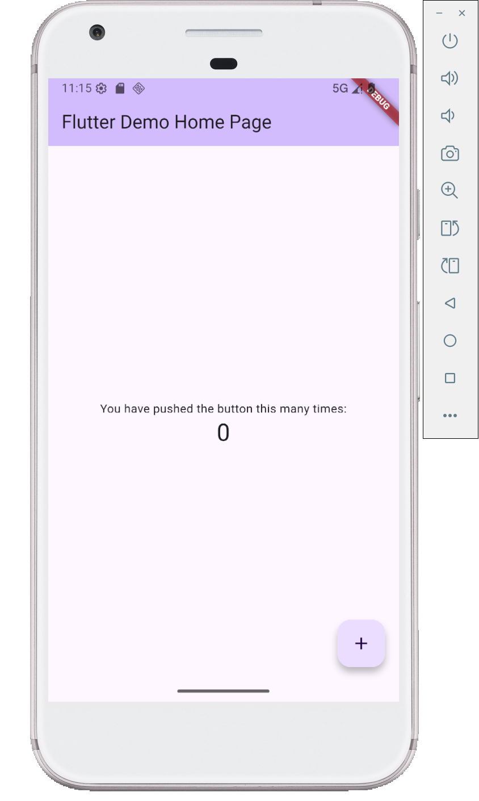

# Logs
```
PS D:\Projects\hello_flutter> flutter run -d emulator-5554
Flutter assets will be downloaded from https://storage.flutter-io.cn. Make sure you trust this source!
Launching lib\main.dart on sdk gphone64 x86 64 in debug mode...
Flutter assets will be downloaded from https://storage.flutter-io.cn. Make sure you trust this source!
Running Gradle task 'assembleDebug'...                             94.5s
✓ Built build\app\outputs\flutter-apk\app-debug.apk
Installing build\app\outputs\flutter-apk\app-debug.apk...        1,528ms
D/FlutterJNI(14190): Beginning load of flutter...
D/FlutterJNI(14190): flutter (null) was loaded normally!
I/flutter (14190): [IMPORTANT:flutter/shell/platform/android/android_context_gl_impeller.cc(104)] Using the Impeller rendering backend (OpenGLES).
Syncing files to device sdk gphone64 x86 64...                     107ms

Flutter run key commands.
r Hot reload. 🔥🔥🔥
R Hot restart.
h List all available interactive commands.
d Detach (terminate "flutter run" but leave application running).
c Clear the screen
q Quit (terminate the application on the device).

A Dart VM Service on sdk gphone64 x86 64 is available at: http://127.0.0.1:8943/RrRHXxxC7u4=/
The Flutter DevTools debugger and profiler on sdk gphone64 x86 64 is available at:
http://127.0.0.1:9100?uri=http://127.0.0.1:8943/RrRHXxxC7u4=/
I/Choreographer(14190): Skipped 129 frames!  The application may be doing too much work on its main thread.
I/WindowExtensionsImpl(14190): Initializing Window Extensions, vendor API level=9, activity embedding enabled=true
I/e.hello_flutter(14190): Compiler allocated 5042KB to compile void android.view.ViewRootImpl.performTraversals()
I/Choreographer(14190): Skipped 54 frames!  The application may be doing too much work on its main thread.
D/ProfileInstaller(14190): Installing profile for com.example.hello_flutter
D/WindowLayoutComponentImpl(14190): Register WindowLayoutInfoListener on Context=com.example.hello_flutter.MainActivity@9e7b66d, of which baseContext=android.app.ContextImpl@3ea4a1c
D/InsetsController(14190): hide(ime(), fromIme=false)
I/ImeTracker(14190): com.example.hello_flutter:acb354df: onCancelled at PHASE_CLIENT_ALREADY_HIDDEN
D/VRI[MainActivity](14190): visibilityChanged oldVisibility=true newVisibility=false
Lost connection to device.
PS D:\Projects\hello_flutter> flutter devices
Flutter assets will be downloaded from https://storage.flutter-io.cn. Make sure you trust this source!
Found 4 connected devices:
  sdk gphone64 x86 64 (mobile) • emulator-5554 • android-x64    • Android 16 (API 36) (emulator)
  Windows (desktop)            • windows       • windows-x64    • Microsoft Windows [版本 10.0.26200.6899]
  Chrome (web)                 • chrome        • web-javascript • Google Chrome 141.0.7390.123
  Edge (web)                   • edge          • web-javascript • Microsoft Edge 142.0.3595.53

Run "flutter emulators" to list and start any available device emulators.

If you expected another device to be detected, please run "flutter doctor" to diagnose potential issues. You may also
try increasing the time to wait for connected devices with the "--device-timeout" flag. Visit https://flutter.dev/setup/
for troubleshooting tips.
PS D:\Projects\hello_flutter> flutter run -d emulator-5554
Flutter assets will be downloaded from https://storage.flutter-io.cn. Make sure you trust this source!
Launching lib\main.dart on sdk gphone64 x86 64 in debug mode...
Flutter assets will be downloaded from https://storage.flutter-io.cn. Make sure you trust this source!
Running Gradle task 'assembleDebug'...                              5.4s
✓ Built build\app\outputs\flutter-apk\app-debug.apk
Installing build\app\outputs\flutter-apk\app-debug.apk...          611ms
D/FlutterJNI( 4002): Beginning load of flutter...
D/FlutterJNI( 4002): flutter (null) was loaded normally!
I/flutter ( 4002): [IMPORTANT:flutter/shell/platform/android/android_context_gl_impeller.cc(104)] Using the Impeller rendering backend (OpenGLES).
Syncing files to device sdk gphone64 x86 64...                      49ms

Flutter run key commands.
r Hot reload. 🔥🔥🔥
R Hot restart.
h List all available interactive commands.
d Detach (terminate "flutter run" but leave application running).
c Clear the screen
q Quit (terminate the application on the device).

A Dart VM Service on sdk gphone64 x86 64 is available at: http://127.0.0.1:8798/a2cRxUhdVqo=/
I/Choreographer( 4002): Skipped 48 frames!  The application may be doing too much work on its main thread.
D/WindowLayoutComponentImpl( 4002): Register WindowLayoutInfoListener on Context=com.example.hello_flutter.MainActivity@684b423, of which baseContext=android.app.ContextImpl@97e3795
D/InsetsController( 4002): hide(ime(), fromIme=false)
I/ImeTracker( 4002): com.example.hello_flutter:1128812c: onCancelled at PHASE_CLIENT_ALREADY_HIDDEN
The Flutter DevTools debugger and profiler on sdk gphone64 x86 64 is available at:
http://127.0.0.1:9100?uri=http://127.0.0.1:8798/a2cRxUhdVqo=/
D/ProfileInstaller( 4002): Installing profile for com.example.hello_flutter
D/InsetsController( 4002): hide(ime(), fromIme=false)
I/ImeTracker( 4002): com.example.hello_flutter:f94a8e81: onCancelled at PHASE_CLIENT_ALREADY_HIDDEN
W/WindowOnBackDispatcher( 4002): sendCancelIfRunning: isInProgress=false callback=android.app.Activity$$ExternalSyntheticLambda0@886433e
Lost connection to device.
PS D:\Projects\hello_flutter>
```
