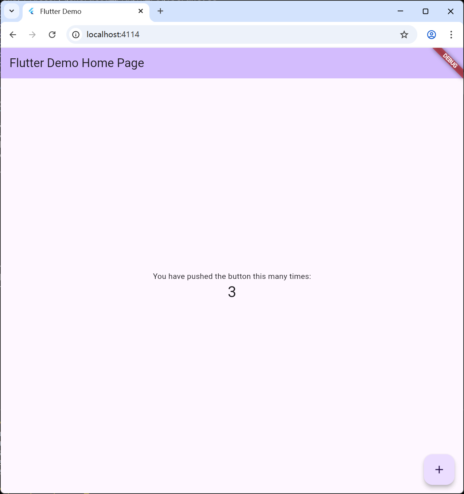

# Logs
```
PS D:\Projects\hello_flutter> flutter run -d chrome
Flutter assets will be downloaded from https://storage.flutter-io.cn. Make sure you trust this source!
Launching lib\main.dart on Chrome in debug mode...
Waiting for connection from debug service on Chrome...             12.9s
This app is linked to the debug service: ws://127.0.0.1:12219/s7c1b_23-UU=/ws
Debug service listening on ws://127.0.0.1:12219/s7c1b_23-UU=/ws

Flutter run key commands.
r Hot reload. 🔥🔥🔥
R Hot restart.
h List all available interactive commands.
d Detach (terminate "flutter run" but leave application running).
c Clear the screen
q Quit (terminate the application on the device).

A Dart VM Service on Chrome is available at: http://127.0.0.1:12219/s7c1b_23-UU=
Starting application from main method in: org-dartlang-app:/web_entrypoint.dart.
The Flutter DevTools debugger and profiler on Chrome is available at:
http://127.0.0.1:9101?uri=http://127.0.0.1:12219/s7c1b_23-UU=
Application finished.
```
