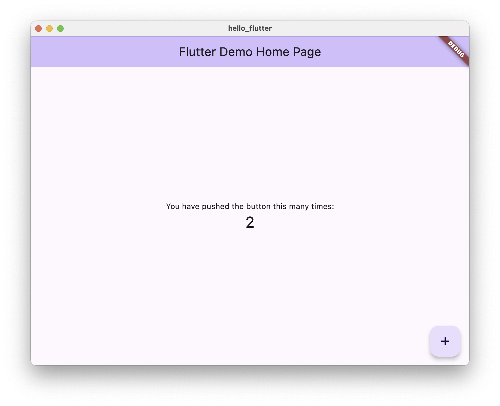

# Logs
```
➜  hello_flutter git:(main) flutter run -d macos
Resolving dependencies...
Downloading packages...
  characters 1.4.0 (1.4.1 available)
  flutter_lints 5.0.0 (6.0.0 available)
  lints 5.1.1 (6.0.0 available)
  material_color_utilities 0.11.1 (0.13.0 available)
  meta 1.16.0 (1.17.0 available)
  test_api 0.7.6 (0.7.7 available)
Got dependencies!
6 packages have newer versions incompatible with dependency constraints.
Try `flutter pub outdated` for more information.
Launching lib/main.dart on macOS in debug mode...
warning: Run script build phase 'Run Script' will be run during every build because it does not specify any outputs. To address this issue, either add output dependencies to the script phase, or configure it to run in every build by unchecking "Based on dependency analysis" in the script phase. (in target 'Flutter Assemble' from project 'Runner')
Building macOS application...
✓ Built build/macos/Build/Products/Debug/hello_flutter.app
2025-11-07 07:57:15.318 hello_flutter[82270:30765195] Running with merged UI and platform thread. Experimental.
Failed to foreground app; open returned 1
Syncing files to device macOS...                                   184ms

Flutter run key commands.
r Hot reload. 🔥🔥🔥
R Hot restart.
h List all available interactive commands.
d Detach (terminate "flutter run" but leave application running).
c Clear the screen
q Quit (terminate the application on the device).

A Dart VM Service on macOS is available at: http://127.0.0.1:49476/-9eK2EN_KHY=/
The Flutter DevTools debugger and profiler on macOS is available at: http://127.0.0.1:9100?uri=http://127.0.0.1:49476/-9eK2EN_KHY=/
2025-11-07 07:57:20.770 hello_flutter[82270:30765195] error messaging the mach port for IMKCFRunLoopWakeUpReliable
Lost connection to device.
```
