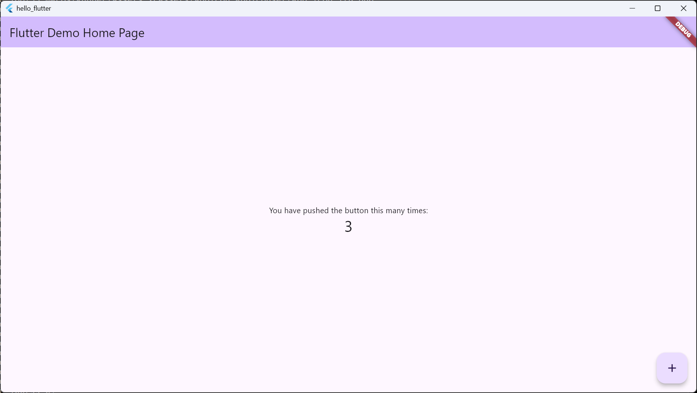

# Logs
```
S D:\Projects\hello_flutter> flutter run -d windows
Flutter assets will be downloaded from https://storage.flutter-io.cn. Make sure you trust this source!
Launching lib\main.dart on Windows in debug mode...
Building Windows application...                                     6.6s
✓ Built build\windows\x64\runner\Debug\hello_flutter.exe
libpng warning: iCCP: known incorrect sRGB profile
libpng warning: iCCP: known incorrect sRGB profile
libpng warning: iCCP: known incorrect sRGB profile
libpng warning: iCCP: known incorrect sRGB profile
libpng warning: iCCP: known incorrect sRGB profile
libpng warning: iCCP: known incorrect sRGB profile
libpng warning: iCCP: known incorrect sRGB profile
libpng warning: iCCP: known incorrect sRGB profile
Syncing files to device Windows...                                  51ms

Flutter run key commands.
r Hot reload. 🔥🔥🔥
R Hot restart.
h List all available interactive commands.
d Detach (terminate "flutter run" but leave application running).
c Clear the screen
q Quit (terminate the application on the device).

A Dart VM Service on Windows is available at: http://127.0.0.1:14272/4e0CD2AXigk=/
The Flutter DevTools debugger and profiler on Windows is available at:
http://127.0.0.1:9100?uri=http://127.0.0.1:14272/4e0CD2AXigk=/
Lost connection to device.
```
